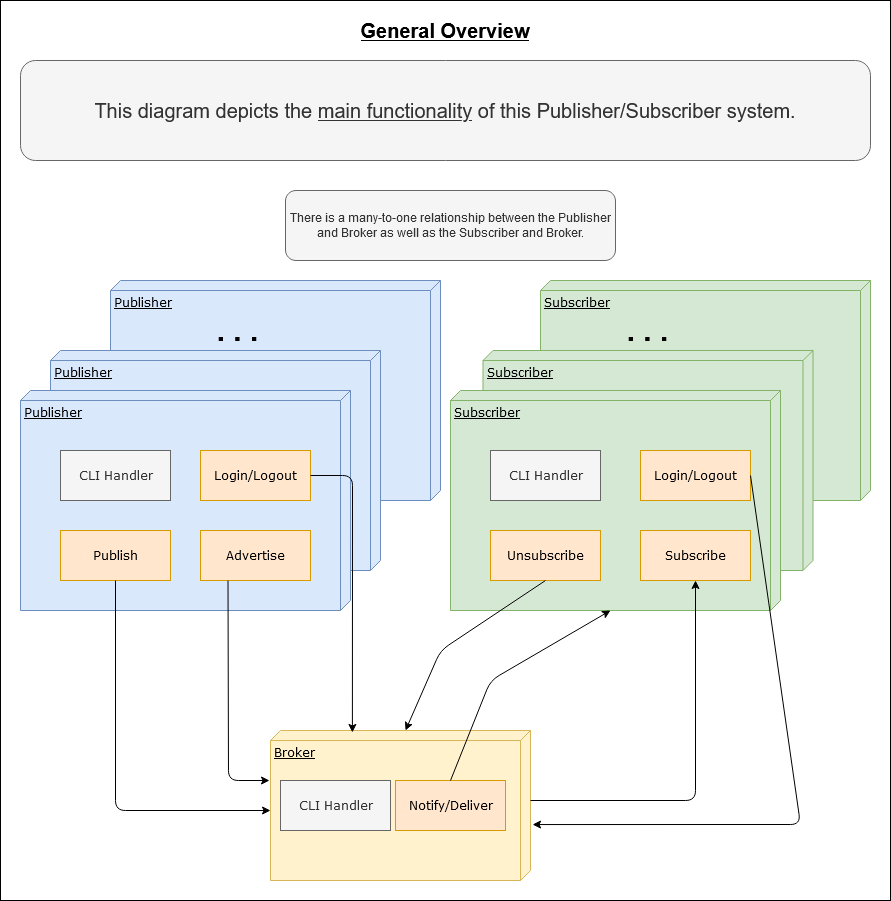
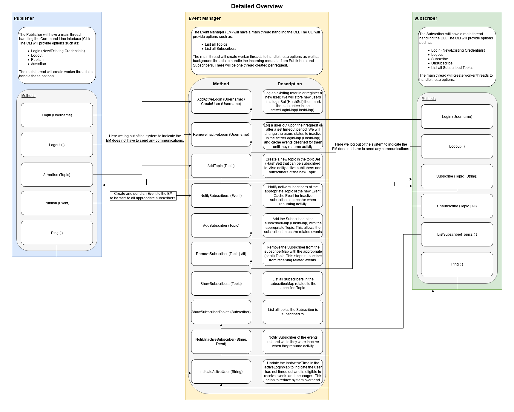
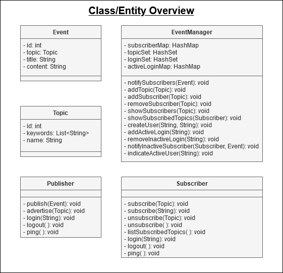
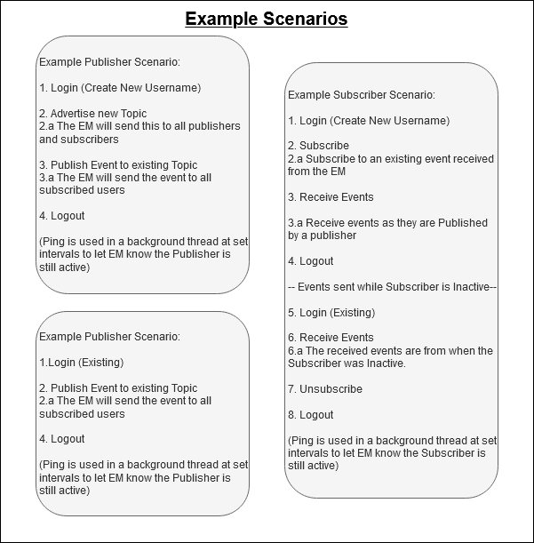

# **Project 2**
The following are publisher, subscriber, event manager programs for CSCI-652-01 Distributed Systems Project 2. 

# **Docker-compose**
Build docker containers:
```
docker-compose -f docker-compose-project2.yml build
```

Start docker containers:
```
docker-compose -f docker-compose-project2.yml up
```

Attach to the running docker containers
```
docker exec -it <CONTAINER-NAME> bash
```
where `<CONTAINER-NAME>` should be replaced with your targeted container name.

Containers:
- `peer1` is the EventManager. Run `java -cp target/project2-1.0-SNAPSHOT.jar edu.rit.cs.EventManager` to start the EventManager.

- `peer2` is a PubSubAgent. Run `java -cp target/project2-1.0-SNAPSHOT.jar edu.rit.cs.PubSubAgent peer1` to start the PubSubAgent.

- `peer3` is a PubSubAgent. Run `java -cp target/project2-1.0-SNAPSHOT.jar edu.rit.cs.PubSubAgent peer1` to start the PubSubAgent.

# **Example Demonstration after Steps Above**

Please follow these steps to simulate/demonstrate the PubSub System:

- peer1:
  - Step 10: ListSubscribers
    - We see Bob subscribed to RIT and John subscribed to UR
- peer2:
  - Step 1: Register
    - Username: John
    - Password: password
  - Step 2: Advertise
    - Topic Name: RIT
  - Step 7: Publish
    - Topic Name: RIT
    - Topic Title: Test Title
    - Topic Content: Test Content
  - Step 9: Subscribe
    - Topic Name: UR
  - Step 11: Logout
    - Here we logout and restart the PubSubAgent!
  - Step 13: Login
    - Username: John
    - Password: password
    - Here we receive the event Bob published while we were logged out!
  - Step 14: Logout
- peer3:
  - Step 3: Register
    - Username: Bob
    - Password: password
  - Step 4: Advertise
    - Topic Name: UR
  - Step 5: List Topics
    - We see RIT and UR listed
  - Step 6: Subscribe
    - Topic Name: RIT
  - Step 8: Receive Event!
  - Step 12: Publish
    - Topic Name: UR
    - Topic Title: Test Title
    - Topic Content: Test Content
  - Step 15: Logout

# **Diagrams**
For an initial overview of the system please review the diagrams under `project2/diagrams`.
These diagrams represent the initial goals I had behind this PubSub system.

General Overview:


Detailed Overview:
This was the initial overview of the system, during implementation design decisions were made to stick with
a combined PubSubAgent that would handle both Publisher and Subscriber tasks. Threads were created to handle
CLI input, sockets, functions, as well has data streams between system components. The ping protocol is
not yet implemented.


Class/Entity Overview:


Example Scenarios:
