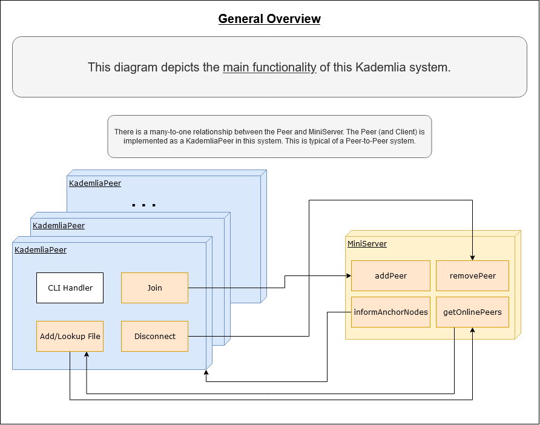
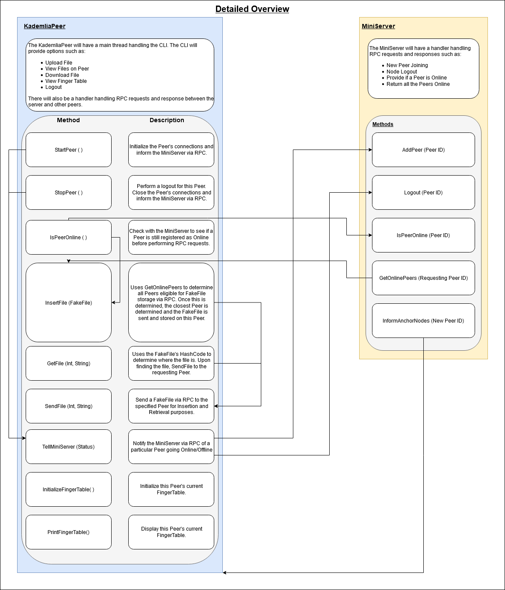
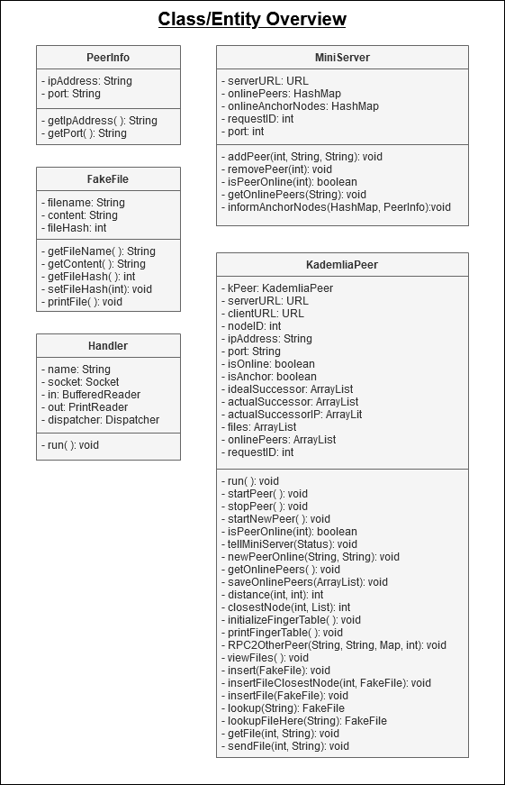

# **Project 3**
The following are Kademlia DHT programs for CSCI-652-01 Distributed Systems Project 3. 

# **Docker-compose**
Build docker containers:
```
docker-compose -f docker-compose-project3.yml build
```

Start docker containers:
```
docker-compose -f docker-compose-project3.yml up
```

Attach to the running docker containers
```
docker exec -it <CONTAINER-NAME> bash
```
where `<CONTAINER-NAME>` should be replaced with your targeted container name.

Containers:
- `miniServer` is the MiniServer. Run `java -cp target/project3-1.0-SNAPSHOT.jar edu.rit.cs.MiniServer` to start the MiniServer.

- `peer2` is a Kademlia Peer (Anchor Node). Run `java -cp target/project3-1.0-SNAPSHOT.jar edu.rit.cs.KademliaPeer 2 peer2` to start the anchor node.

- `peer4` is a Kademlia Peer (Anchor Node). Run `java -cp target/project3-1.0-SNAPSHOT.jar edu.rit.cs.KademliaPeer 4 peer4` to start the anchor node.

- `peer6` is a Kademlia Peer. Run `java -cp target/project3-1.0-SNAPSHOT.jar edu.rit.cs.KademliaPeer 6 peer6` to start the node.

- `peer8` is a Kademlia Peer. Run `java -cp target/project3-1.0-SNAPSHOT.jar edu.rit.cs.KademliaPeer 8 peer8` to start the node.

- `peer11` is a Kademlia Peer. Run `java -cp target/project3-1.0-SNAPSHOT.jar edu.rit.cs.KademliaPeer 11 peer11` to start the node.

- `peer3` is a Kademlia Peer. Run `java -cp target/project3-1.0-SNAPSHOT.jar edu.rit.cs.KademliaPeer 3 peer3` to start the node.

- `peer10` is a Kademlia Peer. Run `java -cp target/project3-1.0-SNAPSHOT.jar edu.rit.cs.KademliaPeer 10 peer10` to start the node.

# **Tasks and Testing Procedures**
- Start 7 docker containers (five Kademlia nodes with IDs: 2, 4, 6, 8, 11, and two clients)
  - Make sure their routing tables are updated correctly.
  - For simplicity, we will use two nodes (ID=2, 4) as anchor nodes. We assume these two nodes are online at all time. Therefore, all requests go through one of these two anchor nodes depending on the distance between a client and the two anchor nodes.
- Place a file into the network from a client node active node (return a hash code of the file when this file is successfully inserted) and query the file.
- Add a new node with a random ID (e.g., 10) and check the routing table and file placement.
- Remove an existing node with a random ID and check the finger table and file placement.

# **Diagrams**
For an initial overview of the system please review the diagrams under `project3/diagrams`.
These diagrams represent the initial goals I had behind this Kademlia DHT system.

General Overview:


Detailed Overview:


Class/Entity Overview:
